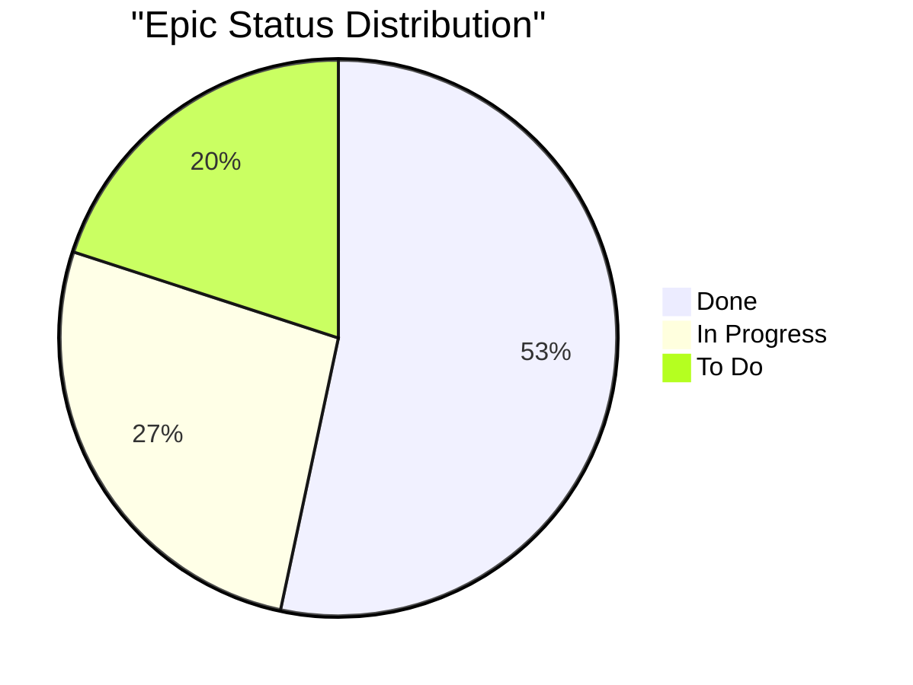

# Skill: Epic & Initiative Grooming

When the user asks to "groom epic", "groom initiative", "check epic health", or "audit epic stories":

## Step 1: Identify Parent Issue
Call `jira_get_issue` on the provided key to determine if it's an Epic or Initiative.

## Step 2: Fetch Child Issues
Call `jira_search` with JQL:
- For Epic: `"Epic Link" = <EPIC_KEY> ORDER BY status ASC`
- For Initiative: `issueFunction in linkedIssuesOf("key = <KEY>") ORDER BY status ASC`

Request fields: `summary,status,assignee,customfield_10002,labels,priority`

## Step 3: Analyze Health

For each child ticket check:
- ⚠️ Unassigned tickets
- ⚠️ Missing story points (customfield_10002 is null or 0)
- ⚠️ Missing labels

Compute:
- Total child tickets
- Status breakdown (Done / In Progress / To Do)
- Total story points and completion percentage

## Step 4: Render Output

Present:
1. **Epic/Initiative Summary** — Key, title, status, total children
2. **Status Breakdown Table** — Grouped by status with ticket counts and points
3. **Mermaid Pie Chart** — Status distribution
4. **At-Risk Items Table** — Unpointed, unassigned, or stale tickets

