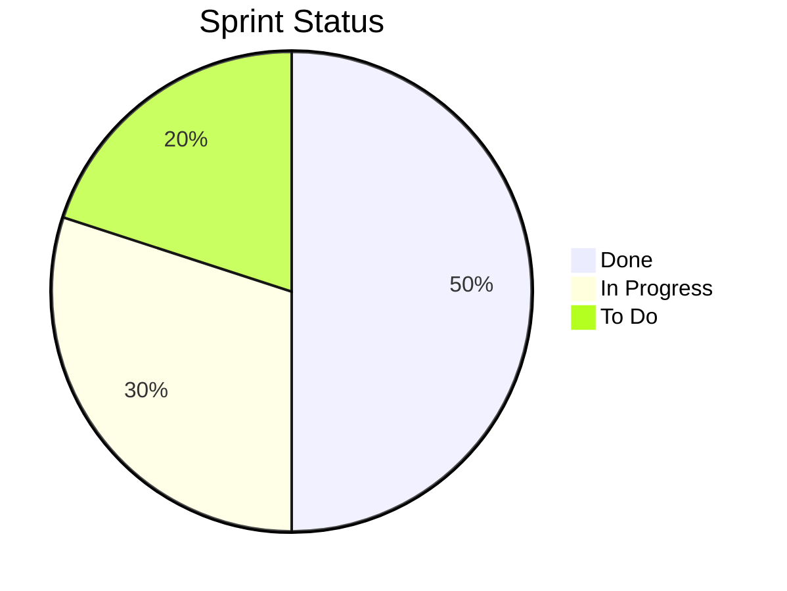

# Skill: Sprint Health Report

When the user asks for a "sprint report", "sprint health", "sprint status", or "developer workload":

## Step 1: Fetch Sprint Data
Call `jira_search` with JQL:
```
project = <PROJECT_KEY> AND sprint in openSprints() ORDER BY status ASC
```
Request fields: `summary,status,assignee,issuetype,priority,customfield_10002,labels`

## Step 2: Compute Metrics

From the returned data, calculate:

### Sprint Overview
- **Total Tickets**: Count of all issues
- **By Status**: Group tickets into Done / In Progress / To Do / Others
- **Story Points**: Sum `customfield_10002` for each status group
- **Completion %**: (Done points / Total points) × 100

### Per-Developer Breakdown
- Group tickets by assignee
- For each developer: count tickets, sum points, show done/in-progress/to-do split

### Issue Type Distribution
- Count by issue type: Story, Bug, Task, Sub-task, etc.

### At-Risk Items
- Unassigned tickets
- Tickets with 0 or no story points
- Tickets still in "Open" or "To Do" status past sprint midpoint

## Step 3: Format Report

Present as structured Markdown with:
- 📈 Sprint Overview section with a completion bar
- 👥 Per-Developer table
- 📂 Issue Type Distribution table
- ⚠️ At-Risk Items list

Use Mermaid pie charts where helpful:

